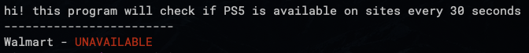

# watch for PS5
A puppeteer program to check for PS5

## currently supports
- [x] walmart
- [ ] need help know other sites im not really trying to buy ps5

## how to use

1. install nodejs current https://nodejs.org/en/
2. download this repository
  - or clone `git clone https://github.com/aloofbit/watch-for-ps5.git`
3. open CMD or terminal
  - windows: (press windows key -> type 'CMD' -> press enter)
  - mac/linux: (cmd-spacebar -> type terminal -> press enter)
4. use cd to navigate to the folder you downloaded
5. run `npm install`
6. run `npm run start`

